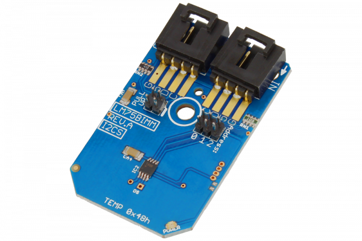

# LM75BIMM

The LM75 temperature sensor includes a delta-sigma analog-to-digital converter and a digital over- temperature detector.The open-drain over-temperature output (OS) sinks current when the programmable temperature limit is exceeded.
This Device is available from www.ncd.io 

[SKU: LM75BIMM_I2CS]

(https://store.ncd.io/product/lis3mdl-3-axis-magnetometer-16-bit-i2c-mini-module/)
This Sample code can be used with Arduino.

Hardware needed to interface LIS3MDL sensor with Arduino

1. <a href="https://store.ncd.io/product/i2c-shield-for-arduino-nano/">Arduino Nano</a>

2. <a href="https://store.ncd.io/product/i2c-shield-for-arduino-micro-with-i2c-expansion-port/">Arduino Micro</a>

3. <a href="https://store.ncd.io/product/i2c-shield-for-arduino-uno/">Arduino uno</a>

4. <a href="https://store.ncd.io/product/dual-i2c-shield-for-arduino-due-with-modular-communications-interface/">Arduino Due</a>

5. <a href="https://store.ncd.io/product/lis3mdl-3-axis-magnetometer-16-bit-i2c-mini-module/">LM75BIMM 16Bit 3Axis Accelometer Sensor</a>

6. <a href="https://store.ncd.io/product/i%C2%B2c-cable/">I2C Cable</a>

LM75BIMM:

The LM75 temperature sensor includes a delta-sigma analog-to-digital converter and a digital over- temperature detector.The open-drain over-temperature output (OS) sinks current when the programmable temperature limit is exceeded.

Applications:

• Computers, office electronics,thermal protection, and test equipment.

How to Use the LM75BIMM Arduino Library

The LM75BIMM has a number of settings, which can be configured based on user requirements.
          
1.Address calling:The following command is used to call the address of LM75BIMM sensor to begin the transmission.

            lm.getAddr_LM75BIMM(LM75BIMM_0_0_1_ADDRESS);            // 0x49, 1001001
            
2.Shut down mode:The following command is used to Disable the Shut down.

            lm.setShutdown(SHUTDOWN_DISABLE);      // Disable (Power-up default)
